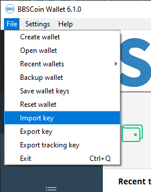

# bbs.money restore

Step 1

You will need to download the BBSCoin Desktop wallet from our website: [https://www.bbscoin.click/download](https://www.bbscoin.click/download), decompress/install. No need to run at moment.

Step 2

Open notepad or other text editor and start with this, replace spendkey and viewkey with your keys(should be same lenght as 0's), if different lenght, please let me know: Each row is 64 characters ->

0000000000000000000000000000000000000000000000000000000000000000

0000000000000000000000000000000000000000000000000000000000000000

YourSpendKeySecret

YourViewKeySecret

It will look something like this:

0000000000000000000000000000000000000000000000000000000000000000 0000000000000000000000000000000000000000000000000000000000000000 abcdef0123456789abcdef0123456789abcdef0123456789abcdef0123456789 1234567890abcdef1234567890abcdef1234567890abcdef1234567890abcdef

Step 3

Now you need to make it a one row/liner, so it looks like this, which is 256 characters:

00000000000000000000000000000000000000000000000000000000000000000000000000000000000000000000000000000000000000000000000000000000abcdef0123456789abcdef0123456789abcdef0123456789abcdef01234567891234567890abcdef1234567890abcdef1234567890abcdef1234567890abcdef

Step 4

Now go to the BBSCoin wallet, and click "File" in the menu, then select "Import Key".

You will paste the one liner into the window that pops up and click \[ OK ]. Then, It will ask you where you would want to save your wallet, select a secure folder in your computer.

.png>)

NOTE: Please, never save it in a public/shared folder where other may be able to access it.

If the wallet does not synchronize, please follow the steps in: [Wallet GUI Synchronization](wallet-gui/synchronization.md)
