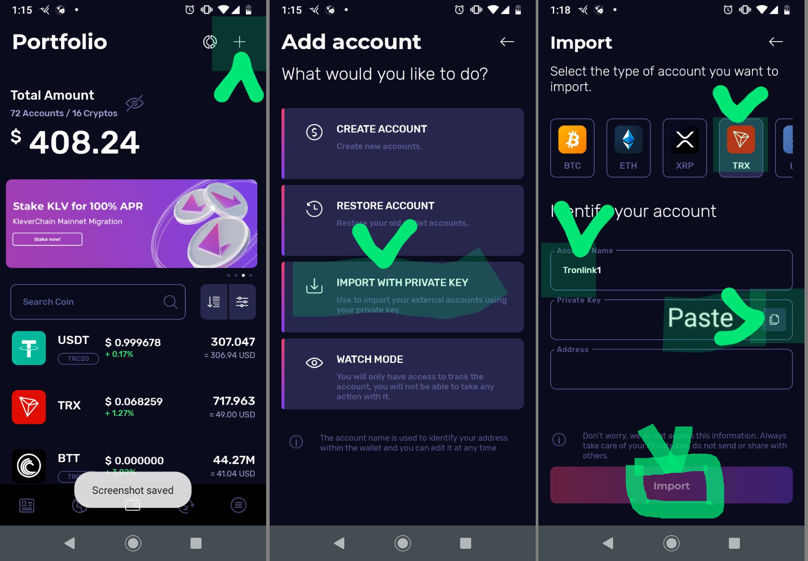

# Tronlink to Klever Wallet

Tronlink: After the last/password screen, It will re-ask you to display your private key, and after that either Copy to the clipboard(computer memory) or export as a file. You will want to use Copy.

Klever Wallet: On the last screen, Select TRX for TRON, then Enter Account Name (You may name something identifiable like Tronlink Wallet or something like that), Hit the paste button to paste the Private Key you Copied from Tronlink, Verify it shows the correct address, then hit the Import button. It will regenerate and load your wallet and synchronize it. Please note that it will only display tokens that are listed on the Klever Wallet.&#x20;

Klever Wallet: To show your tokens, like BBST and WBBS or others you may have, Go to the main wallet Portfolio(linke in the first Screenshot) by tapping the bottom center wallet button, now if your tokens didn't display automatically, then please click on the button with the 3 horizontal lines to the right of the \[ Search Coin ] input, then search for your tokens: BBST and WBBS and enable them, do the same for other tokens you have. Please remember only those tokens listed on Klever wallet will show on the results, and for TRON it would be the TRC tokens.
